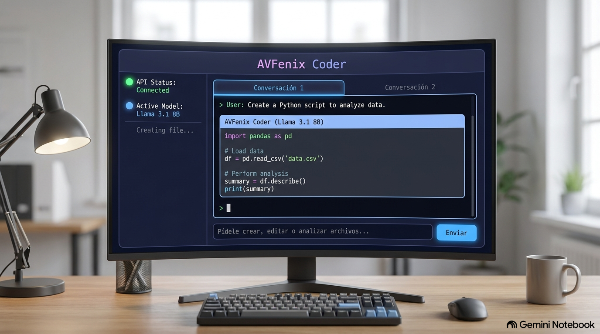

# 🦅 AVFenix Coder

> **El Agente Autónomo de Desarrollo de Software que vive en tu Terminal.**  
> Desarrollado con una arquitectura asíncrona robusta y una interfaz gráfica de consola (TUI) espectacular, optimizado para exprimir el potencial de modelos LLM 100% gratuitos.



---

## 🌟 Características Destacadas

*   **🤖 Bucle de Agente Autónomo (Agent Loop)**: El agente puede razonar de forma recursiva [2]. Si le pides realizar una tarea compleja, invocará herramientas locales mediante etiquetas XML para crear directorios, escribir archivos o aplicar parches quirúrgicos, autoevaluando el resultado y corrigiendo errores sobre la marcha.
*   **📑 Gestión de Pestañas Multi-Conversación**: Cambia de contexto al instante [3]. Puedes tener múltiples sesiones de chat abiertas al mismo tiempo. El historial y memoria de cada pestaña están completamente aislados, lo que te permite organizar diferentes tareas de programación sin cruzar información.
*   **⌨️ Entrada de Texto Inteligente (`ChatInput`)**:
    *   Soporte para múltiples líneas: Presiona `Shift+Enter` para saltar de línea y redactar prompts largos o estructurados.
    *   Envío cómodo: Presiona `Enter` para despachar tu consulta de forma directa.
    *   Historial de prompts integrado: Navega con las **Flechas Arriba/Abajo** para recuperar tus últimos comandos (con guardado inteligente de borradores en caliente).
*   **📋 Copiado de Respuestas con un Clic**: Cada pestaña incluye un botón `📋 Copiar` dedicado que extrae únicamente la conversación activa de forma limpia (excluyendo metadatos o tags del sistema) y la inserta directamente en el portapapeles de tu sistema operativo.
*   **🔌 Selector de Modelos de Costo Cero**: Conectado directamente a la API de OpenRouter. Filtra dinámicamente y prioriza de manera automática los mejores cerebros gratuitos para programación (como *Llama 3.1 8B* o *Qwen 2*), evitando modelos costosos y protegiendo al 100% tu saldo [2].
*   **🛡️ Blindaje de Seguridad Local**: Incluye configuraciones avanzadas de entorno y un archivo `.gitignore` optimizado que evita la fuga accidental de credenciales `.env` a repositorios de GitHub.

---

## 📐 Arquitectura de Desarrollo

La construcción de **AVFenix Coder** se ha estructurado minuciosamente siguiendo la hoja de ruta técnica recomendada para la creación de agentes asíncronos en consola [2]:

1.  **Fase de Arquitectura**: Definición del flujo de ejecución del agente asíncrono asilado.
2.  **Estructura de Carpetas**: Separación modular de responsabilidades (`src/config.py`, `src/tools.py`, `src/prompts.py`, `src/tui.py`).
3.  **Cliente OpenRouter**: Implementación de resiliencia de red y selección dinámica de modelos con coste cero [2].
4.  **CLI Mínima**: Punto de entrada cómodo basado en Typer (`main.py`) con autoejecución por defecto.
5.  **Sistema de Prompts Interno**: System Prompt optimizado que enseña al LLM a comunicarse mediante etiquetas de disco XML estrictas [1, 2].
6.  **Memoria/Sesión**: Estructura de estados asilada por identificadores únicos de pestaña.
7.  **Herramientas de Edición y Ejecución**: Implementación nativa de llamadas a disco (crear, parchar, listar, mover) con control robusto de excepciones [2].
8.  **Pruebas y Empaquetado**: Suite moderna basada en empaquetado estándar de Python (`pyproject.toml`).

---

## 🛠️ Herramientas Autónomas Disponibles en Disco

El agente utiliza las siguientes etiquetas XML para operar sobre tu computadora de forma transparente y segura:

*   `<list_directory path="ruta"/>`: Inspecciona el contenido de cualquier directorio en tiempo real.
*   `<make_directory path="ruta"/>`: Genera carpetas de forma segura con creación de directorios padres automática.
*   `<read_file path="ruta"/>`: Lee y analiza el contenido de archivos de texto locales.
*   `<write_file path="ruta">contenido</write_file>`: Genera o sobrescribe archivos de código completos.
*   `<patch_file path="ruta">`: Modifica líneas de código específicas mediante un motor de reemplazo quirúrgico (`<search>` y `<replace>`).
*   `<move_file source="origen" destination="destino"/>`: Renombra o desplaza archivos y directorios.

---

## 🚀 Instalación y Puesta en Marcha

### Prerrequisitos

*   Python 3.9 o superior.
*   Una API Key activa de **OpenRouter** (puedes obtenerla gratis en [openrouter.ai](https://openrouter.ai/)).

### Pasos de Instalación

1.  **Clona el proyecto** en tu máquina:
    ```bash
    git clone https://github.com/arturo21/avfenix-coder.git
    cd avfenix-coder
    ```

2.  **Crea y activa un entorno virtual**:
    ```bash
    python3 -m venv .venv
    source .venv/bin/activate
    # En Windows: .venv\Scripts\activate
    ```

3.  **Instala el proyecto en modo editable** para habilitar la interfaz interactiva:
    ```bash
    pip install -e .
    ```

4.  **Configura tus variables de entorno**:
    Crea un archivo llamado `.env` en la raíz del proyecto y agrega tu clave de OpenRouter:
    ```env
    OPENROUTER_API_KEY=tu_clave_de_openrouter_aqui
    ```
    *(No te preocupes por la seguridad: nuestro archivo `.gitignore` previene que esta clave se suba a repositorios públicos).*

### Ejecución de la TUI

Inicia la aplicación escribiendo simplemente el siguiente comando en tu consola:
```bash
python main.py
```

---

## 🎨 Contribuir

Si deseas proponer mejoras visuales, nuevos widgets en la interfaz basados en **Textual** [3] o añadir nuevas herramientas locales para tu agente, por favor abre un *Issue* o envía un *Pull Request* al repositorio.

---

## 📄 Licencia

Este proyecto se distribuye bajo la licencia MIT. Siéntete libre de clonarlo, modificarlo y usarlo para acelerar tus flujos de desarrollo autónomo.
