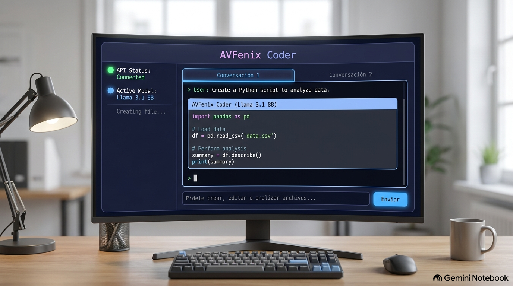

# 🦅 AVFenix Coder

> **El Agente Autónomo de Desarrollo de Software que vive en tu Terminal.**  
> Desarrollado con una arquitectura asíncrona robusta y una interfaz gráfica de consola (TUI) espectacular, optimizado para exprimir el potencial de modelos LLM 100% gratuitos a través de **OpenRouter** y **AnyAPI**.



---

## 🌟 Características Destacadas

*   **🤖 Bucle de Agente Autónomo (Agent Loop)**: El agente puede razonar de forma recursiva. Si le pides realizar una tarea compleja, invocará herramientas locales mediante etiquetas XML para crear directorios, escribir archivos o aplicar parches quirúrgicos, autoevaluando el resultado y corrigiendo errores sobre la marcha.
*   **🌐 Soporte Multi-Proveedor (OpenRouter + AnyAPI)**: Conexión híbrida con **OpenRouter** y **AnyAPI**. La aplicación busca y selecciona automáticamente modelos de IA para programación con conmutación en caliente (*failover*) entre proveedores.
*   **🛡️ Garantía de Coste Cero (SOLO Modelos Gratuitos)**: Sistema de filtrado estricto que inspecciona precios en tiempo real para garantizar que **SOLO se utilicen modelos 100% gratuitos** (como *Llama 3.1 8B*, *Qwen 2* o *Mistral 7B*), protegiendo tu saldo contra cualquier consumo monetario.
*   **📑 Gestión de Pestañas Multi-Conversación**: Cambia de contexto al instante. Puedes tener múltiples sesiones de chat abiertas al mismo tiempo. El historial y memoria de cada pestaña están completamente aislados, lo que te permite organizar diferentes tareas de programación sin cruzar información.
*   **⌨️ Entrada de Texto Inteligente (`ChatInput`)**:
    *   Soporte para múltiples líneas: Presiona `Shift+Enter` para saltar de línea y redactar prompts largos o estructurados.
    *   Envío cómodo: Presiona `Enter` para despachar tu consulta de forma directa.
    *   Historial de prompts integrado: Navega con las **Flechas Arriba/Abajo** para recuperar tus últimos comandos (con guardado inteligente de borradores en caliente).
*   **📋 Copiado de Respuestas con un Clic**: Cada pestaña incluye un botón `📋 Copiar` dedicado que extrae únicamente la conversación activa de forma limpia (excluyendo metadatos o tags del sistema) y la inserta directamente en el portapapeles de tu sistema operativo.
*   **🔌 Protocolo MCP (Model Context Protocol) & Unity Editor**: Integración nativa con servidores MCP (incluyendo el conector para Unity Editor `unity_mcp_server.py` + `UnityMCPBridge.cs`), permitiendo que el agente interactúe en tiempo real con escenas, física, scripts y objetos de videojuegos en Unity.
*   **💾 Memoria & Persistencia de Sesión (Fase 6)**: Guarda de forma atómica el estado de tus pestañas, chats e historial en `avfenix_session.json` para restaurar tu trabajo automáticamente al abrir la aplicación.

---

## 📐 Arquitectura de Desarrollo

La construcción de **AVFenix Coder** se ha estructurado minuciosamente siguiendo la hoja de ruta técnica recomendada para la creación de agentes asíncronos en consola:

1.  **Fase de Arquitectura**: Definición del flujo de ejecución del agente asíncrono aislado.
2.  **Estructura de Carpetas**: Separación modular de responsabilidades (`src/config.py`, `src/tools.py`, `src/prompts.py`, `src/tui.py`, `src/session_manager.py`, `src/mcp_client.py`).
3.  **Cliente Multi-Proveedor (OpenRouter + AnyAPI)**: Conmutación en caliente e inspección estricta de precios para consumo exclusivo de modelos gratuitos.
4.  **CLI Mínima**: Punto de entrada cómodo basado en Typer (`main.py`) con autoejecución por defecto.
5.  **Sistema de Prompts Interno**: System Prompt optimizado que enseña al LLM a comunicarse mediante etiquetas de disco XML estrictas.
6.  **Memoria/Sesión**: Estructura de estados aislada por identificadores únicos de pestaña con persistencia en JSON.
7.  **Herramientas de Edición y Ejecución**: Suite ampliada con 16 herramientas nativas de disco (crear, parchar, listar, mover, buscar código, ejecutar comandos de consola, pruebas unitarias, git status, etc.).
8.  **Integración MCP**: Conexión con servidores MCP externos para interactuar con motores de juego (Unity Editor) o servicios de datos.

---

## 🛠️ Herramientas Autónomas Disponibles en Disco (16 Herramientas)

El agente utiliza las siguientes etiquetas XML para operar sobre tu computadora de forma transparente y segura:

*   `<list_directory path="ruta"/>`: Inspecciona el contenido de cualquier directorio en tiempo real.
*   `<make_directory path="ruta"/>`: Genera carpetas de forma segura con creación de directorios padres automática.
*   `<read_file path="ruta"/>`: Lee y analiza el contenido de archivos de texto locales.
*   `<write_file path="ruta">contenido</write_file>`: Genera o sobrescribe archivos de código completos.
*   `<patch_file path="ruta">`: Modifica líneas de código específicas mediante un motor de reemplazo quirúrgico (`<search>` y `<replace>`).
*   `<move_file source="origen" destination="destino"/>`: Renombra o desplaza archivos y directorios.
*   `<delete_file path="ruta"/>`: Elimina archivos o directorios obsoletos de forma segura.
*   `<tree_directory path="ruta" max_depth="3"/>`: Muestra un diagrama visual en árbol de la carpeta.
*   `<get_file_info path="ruta"/>`: Consulta metadatos del archivo (tamaño, líneas de texto, última modificación).
*   `<search_code query="termino" directory="src"/>`: Busca palabras clave o funciones en todo el código fuente del proyecto.
*   `<find_files pattern="*.py" directory="src"/>`: Encuentra archivos por patrón comodín.
*   `<execute_command timeout="30">comando</execute_command>`: Ejecuta comandos de consola del sistema operativo y captura la salida stdout/stderr.
*   `<run_tests test_path="tests"/>`: Ejecuta pruebas unitarias (`pytest` / `unittest`) y reporta fallos.
*   `<git_status directory="."/>`: Muestra el estado del repositorio Git y cambios pendientes.
*   `<create_backup path="ruta"/>`: Genera una copia de seguridad preventiva en `.avfenix_backups/`.
*   `<fetch_web_page url="https://..."/>`: Extrae el texto visible de páginas web o documentación en línea.

---

## 🚀 Instalación y Puesta en Marcha

### Prerrequisitos

*   Python 3.10 o superior.
*   Una API Key activa de **OpenRouter** y/o **AnyAPI** (puedes configurarlas en tu archivo `.env`).

### Pasos de Instalación

1.  **Clona el repositorio**:
    ```bash
    git clone https://github.com/tu-usuario/avfenix-coder.git
    cd avfenix-coder
    ```

2.  **Crea y activa un entorno virtual**:
    ```bash
    python3 -m venv .venv
    source .venv/bin/activate  # En Windows: .venv\Scripts\activate
    ```

3.  **Instala las dependencias**:
    ```bash
    pip install textual openai requests python-dotenv typer mcp
    ```

4.  **Configura tus variables de entorno (`.env`)**:
    Crea un archivo `.env` en la raíz del proyecto con tus claves de API de proveedores gratuitos:
    ```env
    OPENROUTER_API_KEY=tu_clave_de_openrouter
    ANYAPI_API_KEY=tu_clave_de_anyapi
    ```

5.  **Inicia AVFenix Coder**:
    ```bash
    python main.py
    ```

---

## 📜 Licencia

Este proyecto está bajo la Licencia **MIT**.
